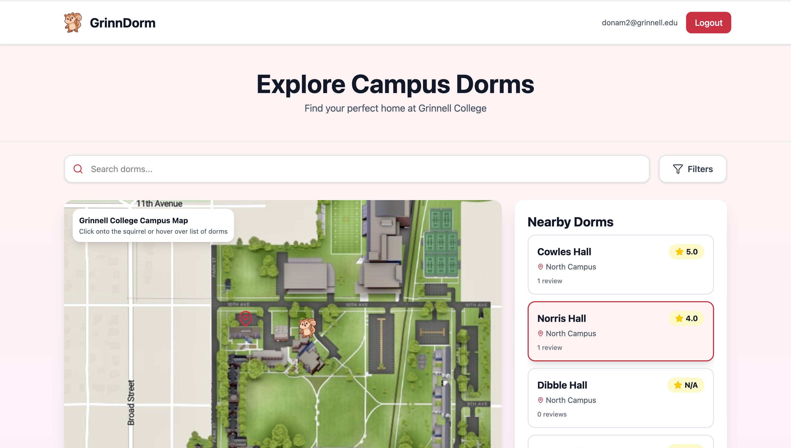

# GrinnDorm 🐿️

A modern, interactive web application for discovering and rating dorms at Grinnell College. Built with cutting-edge technologies and designed with a focus on user experience and clean architecture.



## Demo Video

[Watch the demo](https://drive.google.com/file/d/1tX3mLJA5PNauM8d3dYxFcFCiPcebARo9/view?usp=sharing)

## ✨ Key Features

### 🗺️ Interactive Campus Map with Dynamic Positioning

- **Draggable Squirrel Mascot**: Click-to-pick-up, click-to-drop interactive controls (no need to hold mouse button)
- **Real-time Distance Calculation**: Uses Euclidean distance algorithm to dynamically sort dorms by proximity to the squirrel's position
- **Animated Interactions**: Dragged squirrel transforms into `dragged_squirrel.svg` with bouncing "weeeeee" speech bubble caption for delightful UX
- **Responsive Map**: Campus map automatically adjusts to different screen sizes with smooth interactions

### 🏠 Smart Dorm Discovery

- **Dynamic Nearby Dorms List**: Dorms are automatically sorted by distance from the squirrel's current position—no manual refresh needed
- **Multi-Filter Search**: Filter by campus area (North, South, East, Off-campus), minimum rating (3+, 4+), and search by dorm name
- **Star Ratings & Reviews**: Browse aggregate ratings and review counts for each dorm
- **Dorm Details Page**: Click any dorm to view comprehensive details, ratings, and all user reviews

### 🔐 Secure Authentication System

- **Email-based Sign-up**: Secure email verification with 6-digit code authentication
- **JWT Tokens**: Stateless authentication using JSON Web Tokens for scalability
- **Verified Student Only**: Restricts access to verified Grinnell students
- **Protected Routes**: Backend API routes require valid JWT authentication
- **Nodemailer Integration**: Automated email delivery for verification codes

### 📝 User-Generated Content

- **Anonymous Reviews**: Users can leave detailed reviews without revealing their identity
- **Rating System**: 5-star rating system with optional written feedback
- **Community Insights**: Real dorm experiences shared by actual residents
- **Review Aggregation**: Average ratings calculated in real-time from all reviews

### 🎨 Modern UI/UX Design

- **Gradient Background**: Subtle light red-to-pink gradient that covers the entire page for visual appeal
- **Responsive Design**: Fully responsive layout that works seamlessly on desktop, tablet, and mobile
- **Smooth Animations**: Hover effects, scale transitions, and bouncing elements create engaging interactions
- **Accessibility**: Semantic HTML, proper color contrast, and keyboard-navigable interfaces
- **Brand Consistency**: Custom Grinnell red color scheme throughout the application

### 🚀 Performance & Architecture

- **Vite + React**: Lightning-fast development and production builds with optimal code splitting
- **Tailwind CSS**: Utility-first CSS framework for rapid, maintainable styling
- **Supabase Backend**: Scalable PostgreSQL database with real-time capabilities
- **RESTful API**: Clean API design with proper HTTP methods and error handling
- **Environment Configuration**: Secure environment variable management for sensitive data

## 🛠️ Technology Stack

### Frontend

- **React 18**: Modern UI library with hooks for state management
- **TypeScript**: Type-safe development for fewer runtime errors
- **Vite**: Next-generation build tool with HMR for instant updates
- **Tailwind CSS**: Utility-first CSS framework for responsive design
- **Lucide React**: Beautiful, customizable icon library
- **React Router**: Client-side routing for seamless navigation

### Backend

- **Express.js**: Lightweight, flexible Node.js framework
- **Supabase**: PostgreSQL database with built-in authentication
- **JWT (jsonwebtoken)**: Secure token-based authentication
- **Nodemailer**: Email service for verification code delivery
- **CORS**: Cross-origin resource sharing for secure API access
- **Dotenv**: Environment variable management

### Development & Tools

- **Git**: Version control with GitHub integration
- **ESLint & Prettier**: Code formatting and linting
- **Vite Dev Server**: Instant HMR with optimized dependency pre-bundling

## 📦 Installation & Setup

### Prerequisites

- Node.js 16+ and npm
- Supabase account
- Email service credentials (SMTP)

### Backend Setup

```bash
cd backend
npm install

# Create .env file with:
SUPABASE_URL=your_supabase_url
SUPABASE_KEY=your_supabase_key
SMTP_EMAIL=your_email@gmail.com
SMTP_PASSWORD=your_app_specific_password
JWT_SECRET=your_jwt_secret
PORT=5000

npm start
# Server runs on http://localhost:5000
```

### Frontend Setup

```bash
cd frontend
npm install

# Create .env file with:
VITE_API_BASE_URL=http://localhost:5000/api

npm run dev
# Application runs on http://localhost:3000
```

## 🎯 Core Functionality Walkthrough

### 1. Authentication Flow

1. User enters email on login page
2. Backend sends 6-digit verification code via email
3. User enters code to verify identity
4. JWT token issued and stored in localStorage
5. User is authenticated and can access the main app

### 2. Dynamic Dorm Discovery

1. User lands on homepage with interactive campus map
2. Squirrel is positioned at center of map (50%, 50%)
3. "Nearby Dorms" panel shows all dorms sorted by distance from squirrel
4. User clicks squirrel to pick it up (icon changes, "weeeeee" appears)
5. Cursor movement updates dorm list in real-time
6. User clicks again to drop squirrel at desired location
7. Dorm list updates to show closest dorms to new position

### 3. Filtering & Search

1. Click "Filters" button to expand filter panel
2. Select campus area, minimum rating, or search by name
3. Dorm list instantly updates with filtered results
4. Filtered results are still sorted by distance from squirrel

### 4. Review System

1. User clicks on any dorm to open detailed view
2. Can read existing reviews from other students
3. Click "Write Review" to open review modal
4. Rate dorm (1-5 stars) and optionally add comments
5. Review is submitted anonymously and appears in real-time

## 🔍 Technical Highlights for Employers

### 🎓 Advanced Distance Calculation

```javascript
// Efficient Euclidean distance algorithm for real-time sorting
const calculateDistance = (x1, y1, x2, y2) => {
  return Math.sqrt(Math.pow(x2 - x1, 2) + Math.pow(y2 - y1, 2));
};
```

Demonstrates mathematical problem-solving and optimization thinking

### 🧠 Smart Data Filtering Logic

- When filters are inactive: display all dorms sorted by distance
- When filters are active: display filtered results sorted by distance
- Balances user intent with proximity-based UX

### 🔐 Production-Ready Authentication

- JWT token-based auth (scalable, stateless)
- Email verification prevents unauthorized access
- Secure password handling with Nodemailer SMTP
- Protected API routes with middleware authentication

### 📱 Responsive Component Architecture

- Modular, reusable React components
- Smart state management with useState/useEffect hooks
- Proper separation of concerns (Auth, Home, Details, Reviews)
- Efficient re-rendering with proper dependency arrays

## 📁 Project Structure

```
GrinnDorm/
├── frontend/                           # React + TypeScript frontend
│   ├── public/                        # Static assets
│   │   ├── Squirrel.svg              # Main squirrel mascot icon
│   │   ├── dragged_squirrel.svg       # Squirrel animation when dragging
│   │   ├── CampusMap.png             # Interactive campus map image
│   │   └── preview.png               # App preview screenshot
│   ├── src/
│   │   ├── app/
│   │   │   ├── App.tsx               # Main app component with routing
│   │   │   └── components/
│   │   │       ├── HomePage.tsx      # Main page with campus map & dorms
│   │   │       ├── AuthPage.tsx      # Email-based login page
│   │   │       ├── DormDetailsPage.tsx # Detailed dorm info & reviews
│   │   │       ├── ReviewModal.tsx   # Modal for submitting reviews
│   │   │       └── Header.tsx        # Navigation header
│   │   ├── config/
│   │   │   └── api.ts               # API endpoint configurations
│   │   ├── styles/                   # Global styles and themes
│   │   └── main.tsx                  # React entry point
│   ├── vite.config.ts               # Vite build configuration
│   ├── package.json                 # Frontend dependencies
│   └── index.html                   # HTML template
│
├── backend/                           # Express.js backend API server
│   ├── routes/
│   │   ├── auth.js                  # Authentication endpoints
│   │   └── dorms.js                 # Dorm and review endpoints
│   ├── middleware/
│   │   └── authMiddleware.js        # JWT protection middleware
│   ├── utils/
│   │   ├── emailService.js          # Email delivery service
│   │   └── jwtUtils.js              # Token generation & management
│   ├── server.js                    # Express server initialization
│   ├── seed.js                      # Database seeding script
│   ├── package.json                 # Backend dependencies
│   └── .env                         # Environment variables
│
├── .github/
│   └── copilot-instructions.md      # Documentation for Copilot sessions
│
└── README.md                        # This file
```

### Key Component Descriptions

#### Frontend Components

- **HomePage.tsx** - Interactive campus map with draggable squirrel, dynamic dorm sorting, real-time filtering, and nearby dorms list
- **AuthPage.tsx** - Email-based signup with 6-digit verification code and JWT token storage
- **DormDetailsPage.tsx** - Detailed dorm information with full review listing and back navigation
- **ReviewModal.tsx** - 5-star rating system with optional text feedback and real-time validation
- **Header.tsx** - Navigation header with user info and logout functionality

#### Backend Architecture

- **auth.js** - Signup and code verification endpoints
- **dorms.js** - Dorm and review data endpoints
- **authMiddleware.js** - JWT token protection for routes
- **emailService.js** - Email delivery configuration
- **jwtUtils.js** - Token generation and management

## 📊 API Endpoints

### Authentication

- `POST /api/auth/signup` - Request verification code
- `POST /api/auth/verify` - Verify code and get JWT token

### Dorms

- `GET /api/dorms` - Get all dorms with ratings
- `GET /api/dorms/:id` - Get specific dorm details

### Reviews

- `POST /api/dorms/:id/reviews` - Submit a review
- `GET /api/dorms/:id/reviews` - Get all reviews for a dorm

## 🚀 Future Enhancement Ideas

- **Advanced Analytics**: Trending dorms, popular review topics
- **User Profiles**: Review history, saved favorites
- **Photo Upload**: Let students upload dorm photos
- **Video Tours**: Embedded dorm walkthrough videos
- **Community Features**: Comments on reviews, helpful voting
- **Mobile App**: React Native version for iOS/Android

## 🤝 Contributing

This project is actively being developed. Contributions are welcome! Please ensure code follows the existing style and includes proper error handling.

## 📝 License

MIT License - Feel free to use this as a reference for your projects

---

**Built with ❤️ for Grinnell College** | Designed to make dorm discovery fun and interactive 🐿️

## Author

Nam Do
